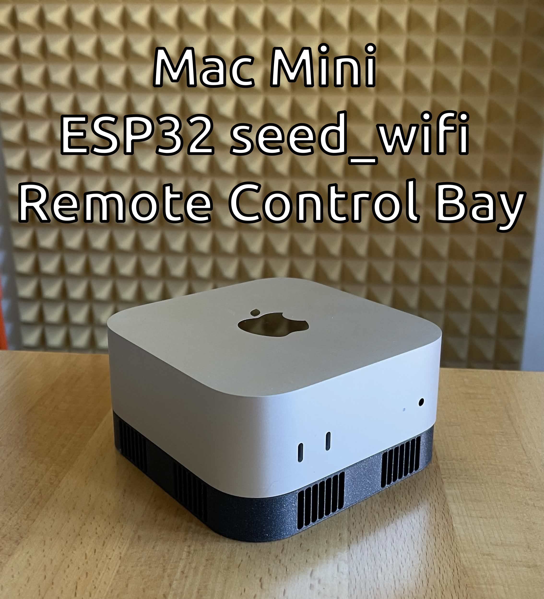
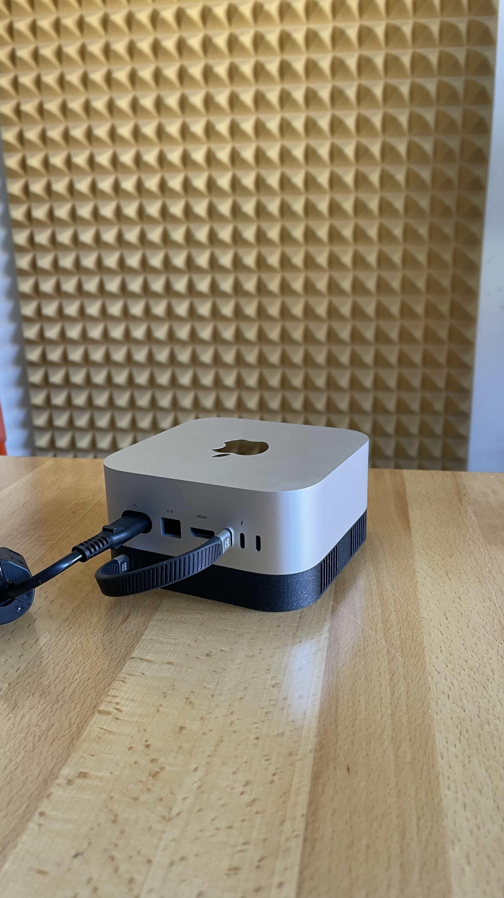
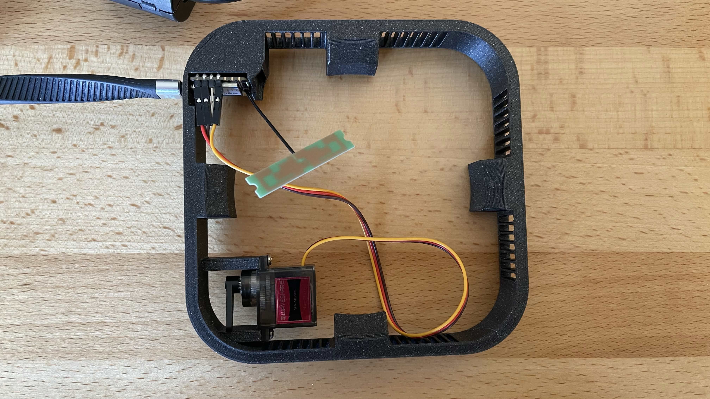

# seed_wifi



Remote Mac Mini power control and keyboard input via ESP32S3 over WireGuard VPN.

Fork of [phokz/seed_wifi](https://github.com/phokz/seed_wifi).

---

## What it does

The ESP32S3 sits inside a 3D-printed enclosure physically mounted over the Mac Mini's power button. It connects to your WiFi and exposes an HTTP API through a WireGuard VPN tunnel. You can:

- **Turn the Mac Mini on** — servo smoothly presses the power button and releases
- **Turn the Mac Mini off** — servo presses and holds the power button for 11 seconds (force shutdown)
- **Type text** — injects keystrokes via USB HID (passwords, commands, etc.)

---

## Hardware

- Seeed XIAO ESP32S3
- Generic UFL dual band antenna
- SG90 180° servo on pin **D10**
- 3D-printed enclosure ([MiniMacBay.stl](stl/MiniMacBay.stl)) — also available as [STEP](stl/bay.step) — Fusion 360 source: [Bay-fusion project.f3z](stl/Bay-fusion%20project.f3z)
- USB-C cable

| | |
|---|---|
|  |  |

---

## API

All endpoints on port 80 of the WireGuard IP. Protected with `X-Auth` header if token is set.

| Method | Endpoint | Body | Description |
|--------|----------|------|-------------|
| POST | `/power-on` | — | Press power button (turns Mac on) |
| POST | `/power-off` | — | Hold power button 11s (force shutdown) |
| POST | `/keys` | `keys=<text>` | Type text via USB HID |
| GET | `/health` | — | WiFi + WireGuard status |

### Examples

```bash
# Turn on
curl -X POST http://100.64.0.10/power-on -H "X-Auth: yourtoken"

# Force off
curl -X POST http://100.64.0.10/power-off -H "X-Auth: yourtoken"

# Type a password
curl -X POST http://100.64.0.10/keys -d "keys=mypassword" -H "X-Auth: yourtoken"

# Check status
curl http://100.64.0.10/health
```

---

## Build

All config is passed as compiler flags — no secrets in source code.

```bash
arduino-cli compile \
  --fqbn esp32:esp32:XIAO_ESP32S3 \
  -D WIFI_SSID=\"your-ssid\" \
  -D WIFI_PASS=\"your-password\" \
  -D WG_PRIVATE_KEY=\"your-wg-private-key\" \
  -D WG_LOCAL_IP=\"100.64.0.10\" \
  -D WG_PEER_PUBLIC_KEY=\"peer-public-key\" \
  -D WG_PEER_HOST=\"wg.yourdomain.com\" \
  -D WG_PEER_PORT=51820 \
  -D HTTP_AUTH_TOKEN=\"yourtoken\" \
  seed_wifi/

arduino-cli upload -p /dev/ttyACM0 --fqbn esp32:esp32:XIAO_ESP32S3 seed_wifi/
```

---

## Servo tuning

Adjust these constants at the top of `seed_wifi.ino` to match your physical mounting:

```cpp
const int START_US = ...;              // resting position (move the servo arm where its touching the brace on the model (7°by default, edit if nescesarry)
const int END_US   = ...;              // fully pressed position (30°by default, edit if nescesarry)
const unsigned long SWEEP_MS = 3000;  // how long the press (on) movement takes
const unsigned long HOLD_MS  = 11000; // how long to hold until moving back to the resting position - used for turning the mac mini off)
```

---

## WireGuard setup

Uses [WireGuard-ESP32-Arduino](https://github.com/robhany/WireGuard-ESP32-Arduino). Generate a key pair for the device:

```bash
wg genkey | tee privatekey | wg pubkey > publickey
```

Add the device as a peer on your WireGuard server, then pass the keys as build flags.

---

## Upload procedure (Linux)

1. On your ESP32, hold **BOOT**, tap **RESET**, release **BOOT**
2. `sudo chmod a+rw /dev/ttyACM0`
3. Run the upload command above
4. Press **RESET** to boot into the new firmware

Permanent fix: `sudo usermod -a -G dialout $USER` (requires logout/login)

---

## Known issue: power loss on shutdown

When the Mac Mini shuts down, its USB ports lose power — taking the ESP32 with it, making remote power-on impossible. Fix with either a small LiPo on the battery connector, or an always-on external USB power source with a diode wired in series.

---

## Security

This device can type anything on the computer it's plugged into. Treat it like root access. Keep the WireGuard private key secret and always set an `HTTP_AUTH_TOKEN`.
